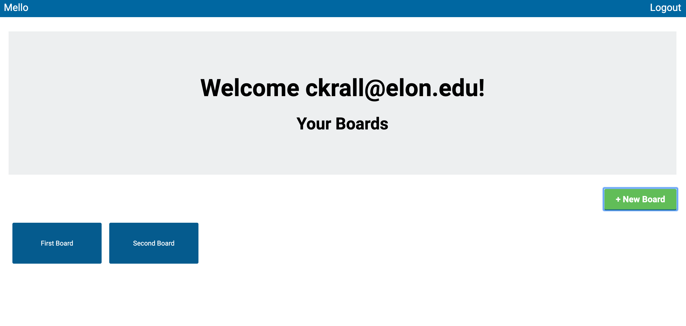

# Mello

This is a kanban board app created to expand my knowledge of Javascript and jQuery. Users can create an account, allowing them to create boards to organize and complete tasks. 

The app was built within a Ruby on Rails framework. The information is saved to a PostgreSQL database. jQuery was used for all the functionality of the app, from handling account creation, to adding boards, lists and cards. The use of Javascript and jQuery allowed for realtime DOM updates without page refreshes.

## Click [here](https://mello-fullstack.herokuapp.com/) to visit the website!

This is the login page:

Once logged in the user's available boards get displayed:

Inside the board users can create different lists and cards:

Users can collaborate with others to help with cards:

## Tools & Resources

* [Ruby on Rails](https://rubyonrails.org/) 
* [PostgreSQL](https://www.postgresql.org/)
* [Bootstrap](https://getbootstrap.com/)
* [jQuery](https://jqueryui.com/)